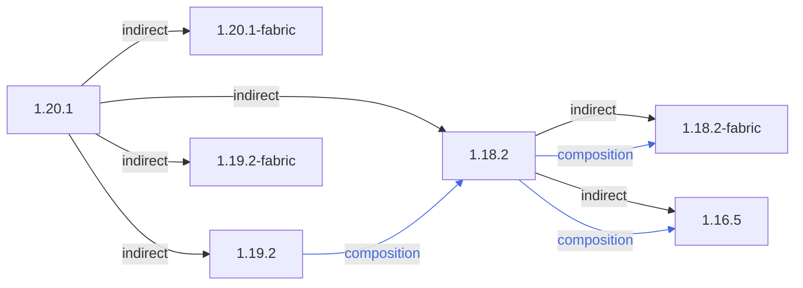

### 总概



```
1.20.1
 ├── 1.20.1-fabric
 ├── 1.19.2 (composition)
 ├── 1.19.2-fabric (singleton)(composition)
 └── 1.18.2 (composition)
      ├── 1.18.2-fabric (singleton)
      └── 1.16.5
```

### 链接区域

- [1.16.5](/projects/assets/macaws-bridges-oh-the-biomes-youll-go/1.16/macawsbridgesbyg)
- [1.18.2](/projects/assets/macaws-bridges-oh-the-biomes-youll-go/1.18/macawsbridgesbyg)
- [1.19.2](/projects/assets/macaws-bridges-oh-the-biomes-youll-go/1.19/macawsbridgesbyg)
- [1.20.1](/projects/assets/macaws-bridges-oh-the-biomes-youll-go/1.20/macawsbridgesbyg)
- [1.18.2-fabric](/projects/assets/macaws-bridges-oh-the-biomes-youll-go/1.18-fabric/macawsbridgesbyg)
- [1.19.2-fabric](/projects/assets/macaws-bridges-oh-the-biomes-youll-go/1.19/macawsbridgesbyg)
- [1.20.1-fabric](/projects/assets/macaws-bridges-oh-the-biomes-youll-go/1.20-fabric/macawsbridgesbyg)