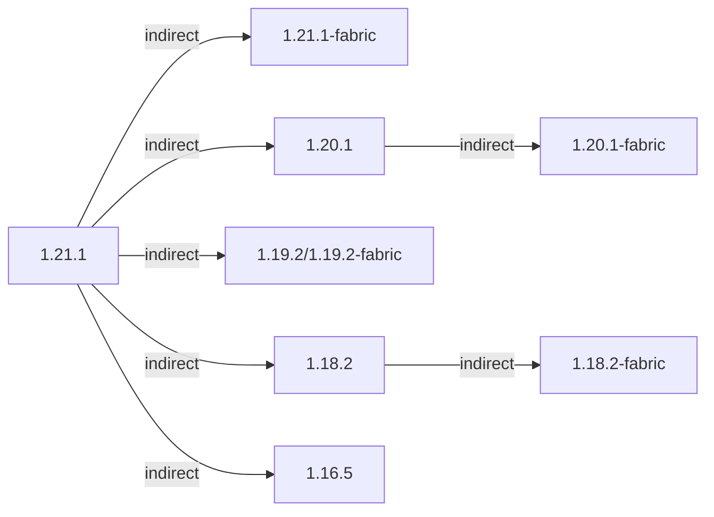

### 总概



```
1.21.1
 ├── 1.21.1-fabric
 ├── 1.20.1
 │    └── 1.20.1-fabric
 ├── 1.19.2/1.19.2-fabric
 ├── 1.18.2
 │    └── 1.18.2-fabric
 └── 1.16.5
```

### 链接区域

- [1.16.5](/projects/assets/macaws-fences-and-walls/1.16/mcwfences)
- [1.18.2](/projects/assets/macaws-fences-and-walls/1.18/mcwfences)
- [1.19.2](/projects/assets/macaws-fences-and-walls/1.19/mcwfences)
- [1.20.1](/projects/assets/macaws-fences-and-walls/1.20/mcwfences)
- [1.21.1](/projects/assets/macaws-fences-and-walls/1.21/mcwfences)
- [1.18.2-fabric](/projects/assets/macaws-fences-and-walls/1.18-fabric/mcwfences)
- [1.20.1-fabric](/projects/assets/macaws-fences-and-walls/1.20-fabric/mcwfences)
- [1.21.1-fabric](/projects/assets/macaws-fences-and-walls/1.21-fabric/mcwfences)