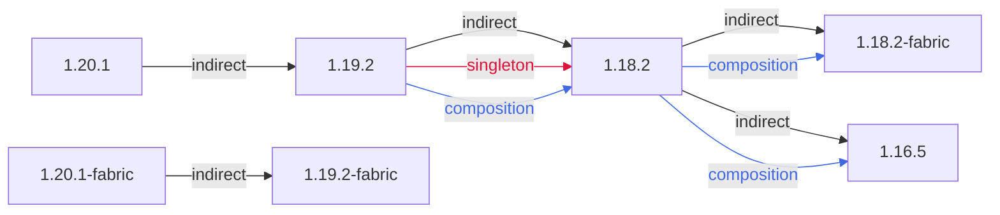

### 总概



```
1.20.1
 └── 1.19.2 (singleton)(composition)
      └── 1.18.2 (composition)
           ├── 1.18.2-fabric (singleton)
           └── 1.16.5
1.20.1-fabric
 └── 1.19.2-fabric (singleton)(composition)
```

### 链接区域

- [1.16.5](/projects/assets/macaws-roofs-oh-the-biomes-youll-go/1.16/macawsroofsbyg)
- [1.18.2](/projects/assets/macaws-roofs-oh-the-biomes-youll-go/1.18/macawsroofsbyg)
- [1.19.2](/projects/assets/macaws-roofs-oh-the-biomes-youll-go/1.19/macawsroofsbyg)
- [1.20.1](/projects/assets/macaws-roofs-oh-the-biomes-youll-go/1.20/macawsroofsbyg)
- [1.18.2-fabric](/projects/assets/macaws-roofs-oh-the-biomes-youll-go/1.18-fabric/macawsroofsbyg)
- [1.19.2-fabric](/projects/assets/macaws-roofs-oh-the-biomes-youll-go/1.19/z_mcwroofsbyg)
- [1.20.1-fabric](/projects/assets/macaws-roofs-oh-the-biomes-youll-go/1.20-fabric/z_mcwroofsbyg)