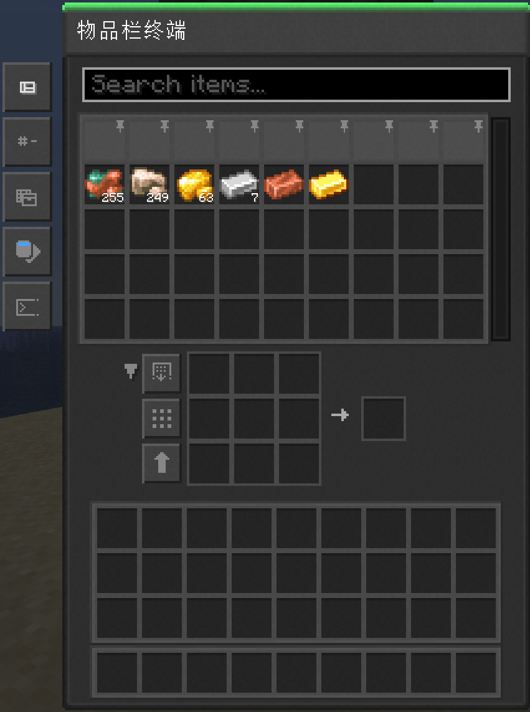

---
navigation:
  parent: items-blocks/index.md
  icon: inventory_terminal
  title: 物品栏终端
categories:
  - terminal
description: "[网络存储](../nodeworks-mechanics/network-storage.md)的视窗"
item_ids:
- nodeworks:inventory_terminal
---

# 物品栏终端

物品栏终端是[网络存储](../nodeworks-mechanics/network-storage.md)的视窗。

<BlockImage scale="6" id="inventory_terminal" />

## 浏览网络

- 左击拿取一组
- 右击拿取半组
- 双击将所有同种物品汇至鼠标
- 向方格放下鼠标上的物品堆叠可向[网络存储](../nodeworks-mechanics/network-storage.md)输入
- 鼠标上有物品堆叠时对方格右击可输入一个
- 按住`Alt`以显示网络中可自动合成的物品

左侧按钮为：

- 改变布局
- 排序方式
- 筛选方式（库存、配方、两者）
- 资源类型（物品、流体、两者）
- 切换自动聚焦搜索框与否

中央为可收起的合成方格，方格旁的按钮为：

- 自动从网络中抽取
- 在方格中均分原材料
- 将方格中的原材料送至网络存储

## 配方

<RecipeFor id="inventory_terminal" />