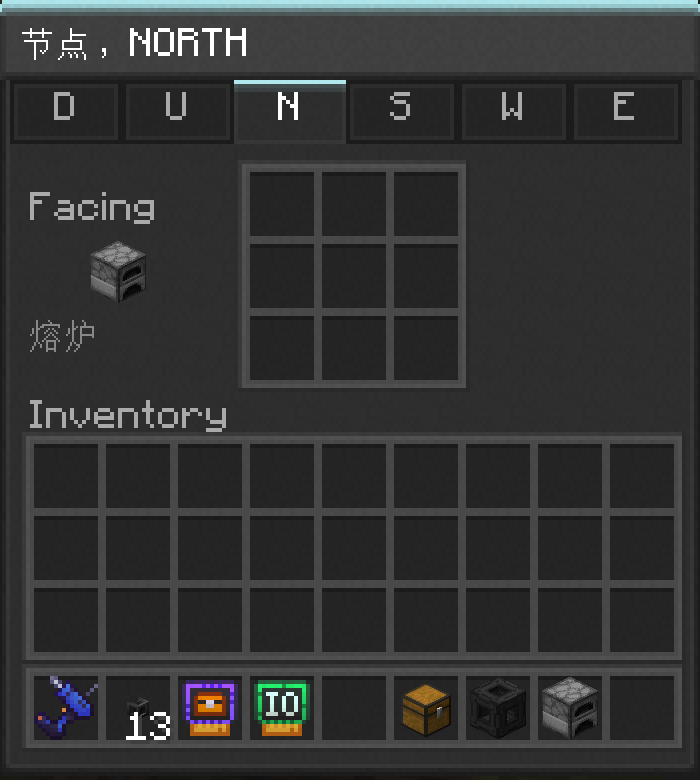

---
navigation:
  parent: items-blocks/index.md
  icon: io_card
  title: IO卡
categories:
  - card
description: 用于通过脚本读写物品/流体容器
item_ids:
- nodeworks:io_card
---

# IO卡

IO卡可让网络按需读写相邻方块的物品栏。安装IO卡后，脚本可查询方块的内容物，且能向其移入/从中移除物品和流体。

<ItemImage scale="6" id="io_card" />

## 安装

IO卡需安装于<ItemLink id="node" />的某一面。右击朝向需控制方块的节点面，将IO卡放入9个槽位中的任意一个。卡片的行为会应用于*该面*，也即同一节点可有多张IO卡在不同面控制不同相邻方块。

## 功能

配有IO卡的方块会作为可被脚本访问的物品栏在网络中显示：

- `card:find(filter)`返回相应内容物的[ItemsHandle](../lua-api/items-handle.md)。
- `card:insert(items)`/`card:tryInsert(items)`尝试向其移入物品。
- `card:count(filter)`统计匹配的物品（和流体，以mB计）。

和<ItemLink id="storage_card" />不同，IO卡对应方块**不是**[网络存储](../nodeworks-mechanics/network-storage.md)的成员。脚本需要显式对IO卡方块送入/取出物品，网络无法通过`network:find`查看这些方块的内容物，<ItemLink id="inventory_terminal" />和<ItemLink id="portable_inventory_terminal" />也不会列出它们。

## 频道

IO卡的GUI中有一个频道选择器。有关频道限制脚本与预设能否访问此卡片的详情，参见[选择频道](../lua-api/channel.md#选择频道)。

## 脚本

IO卡handle中可用方法的完整列表参见[CardHandle参考](../lua-api/card-handle.md#物品栏卡)。

## 配方

<RecipeFor id="io_card" />