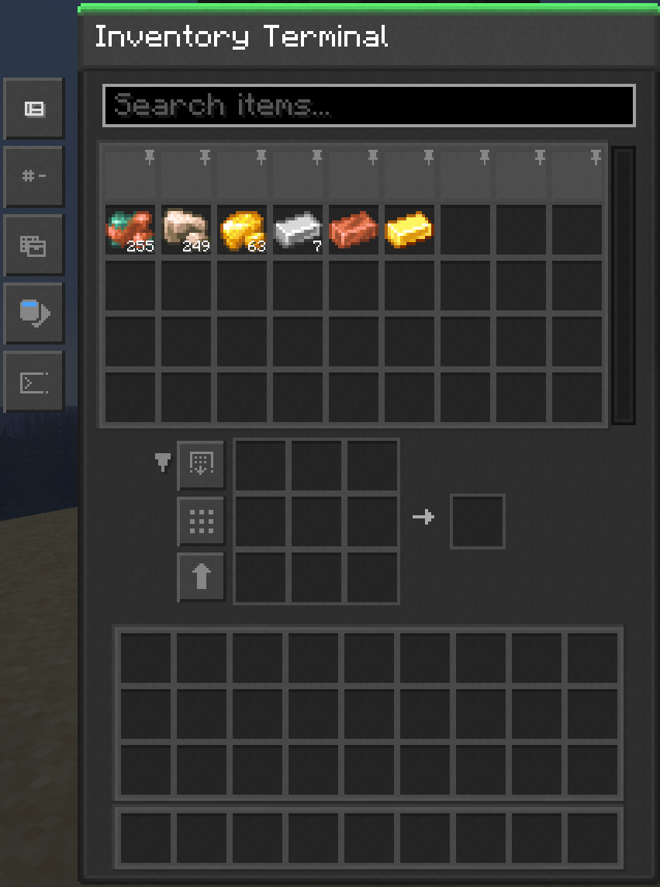

---
navigation:
  parent: items-blocks/index.md
  icon: inventory_terminal
  title: Inventory Terminal
categories:
  - terminal
description: a viewport into [Network Storage](../nodeworks-mechanics/network-storage.md)
item_ids:
- nodeworks:inventory_terminal
---

# Inventory Terminal

The Inventory Terminal is a viewport into a [network's storage](../nodeworks-mechanics/network-storage.md).

<BlockImage scale="6" id="inventory_terminal" />

## Browsing the grid

- Left-click grabs a stack
- Right-click takes half a stack
- Double-click collects all matching items onto cursor
- Dropping a carried stack onto the grid inserts into [Network Storage](../nodeworks-mechanics/network-storage.md)
- Right-clicking a carried stack into the grid inserts one item
- Hold `Alt` to show auto-craftable items in the network

The left side has buttons for:

- Changing layouts
- Sorting the grid
- Filtering by (storage, recipes, or both)
- The kind (items, fluids, or both)
- Auto-focus search toggle

And in the center is a collapsible crafting grid with buttons to:

- Auto-pull from network
- Distribute ingredients evenly in the crafting grid
- Push ingredients in the crafting grid to the network storage

## Recipes

<RecipeFor id="inventory_terminal" />