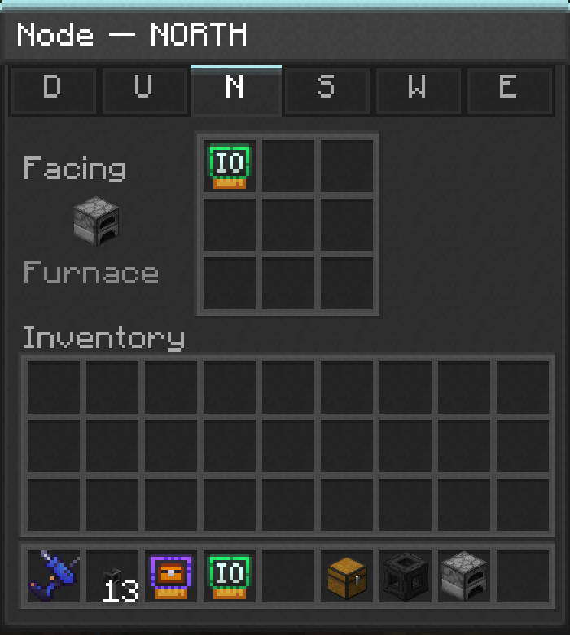

---
navigation:
  parent: items-blocks/index.md
  icon: node
  title: Node
categories:
  - infrastructure
description: card host on a pipe network
item_ids:
- nodeworks:node
- nodeworks:focus_node
---

# Node

A Node is the block that holds [Cards](../nodeworks-mechanics/cards.md). The
network's connectivity itself runs through [Pipes](pipe.md). A Node is what
you drop into a pipe run wherever you want cards to interact with a
neighbouring block.

<BlockImage scale="6" id="node" />

## Faces

Each face adapts to whatever's next to it. A face touching another
network block becomes part of the pipe and disables its card slots. A
face touching a regular block hosts cards that target that neighbour.

## Opening the GUI

Right-click a non-Pipe face to open its card grid. Shift + right-click
opens the *opposite* face. Handy when the side you want is buried. Pipe
faces don't open; their tab in the side picker appears dimmed.

## Cards

Drop a card into any of the 9 slots on a Device face to give that face
a capability:

- <ItemImage scale="0.5" id="io_card" /> <ItemLink id="io_card" />: lets the
  network move items in and out of the adjacent block.
- <ItemImage scale="0.5" id="storage_card" /> <ItemLink id="storage_card" />:
  marks the adjacent block's inventory as Network Storage.
- <ItemImage scale="0.5" id="redstone_card" /> <ItemLink id="redstone_card" />:
  reads and emits redstone signals from this face.
- <ItemImage scale="0.5" id="observer_card" /> <ItemLink id="observer_card" />:
  reads the state of the block it's facing

Multiple cards on one face stack. A face with both an IO card and a
Redstone card can move items AND emit a redstone signal from the same
side.

## Focus Node

<GameScene interactive={true} zoom="5">
  <IsometricCamera yaw="200" pitch="10" />
  <ImportStructure src="../assets/assemblies/focus_node.snbt" />
</GameScene>

A <ItemLink id="focus_node" /> is a Node variant for long-distance
connections. Pair two Focus Nodes with the
<ItemLink id="network_wrench" /> and the network treats them as
connected even when there's no continuous Pipe between them, useful for
bridging across gaps or jumping between separated machine clusters
without running a Pipe the whole way.

Focus Nodes still behave like regular Nodes for their six faces: same
Pipe / Device / Free roles, same card slots, same auto-connection to
adjacent Pipes. The wrench-paired link is in addition to whatever
adjacency they pick up locally.

## Recipe

<RecipeFor id="node" />

<RecipeFor id="focus_node" />
